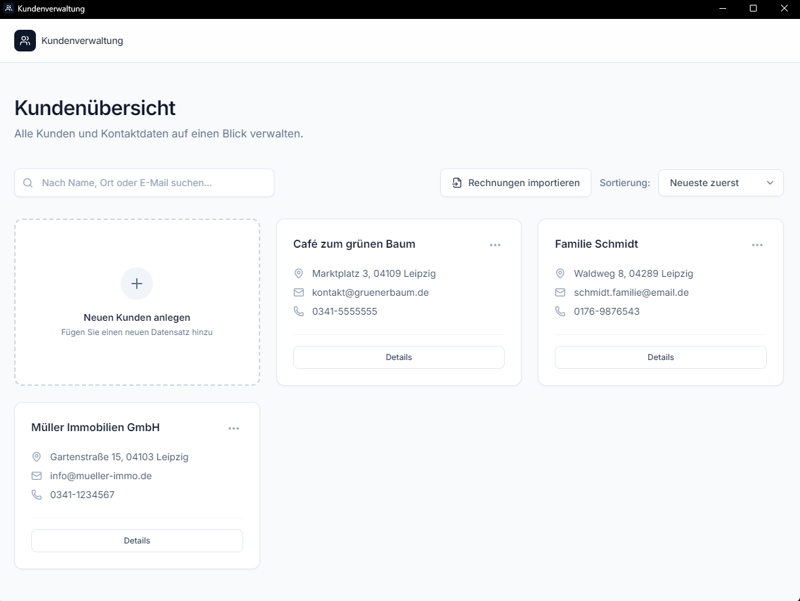
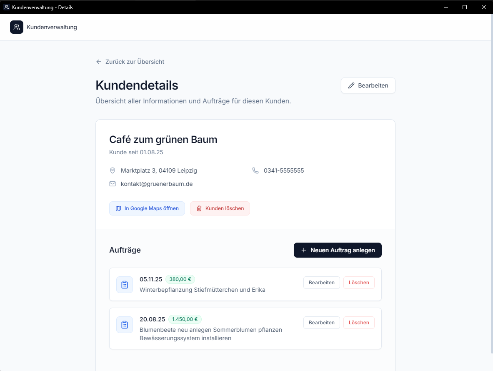
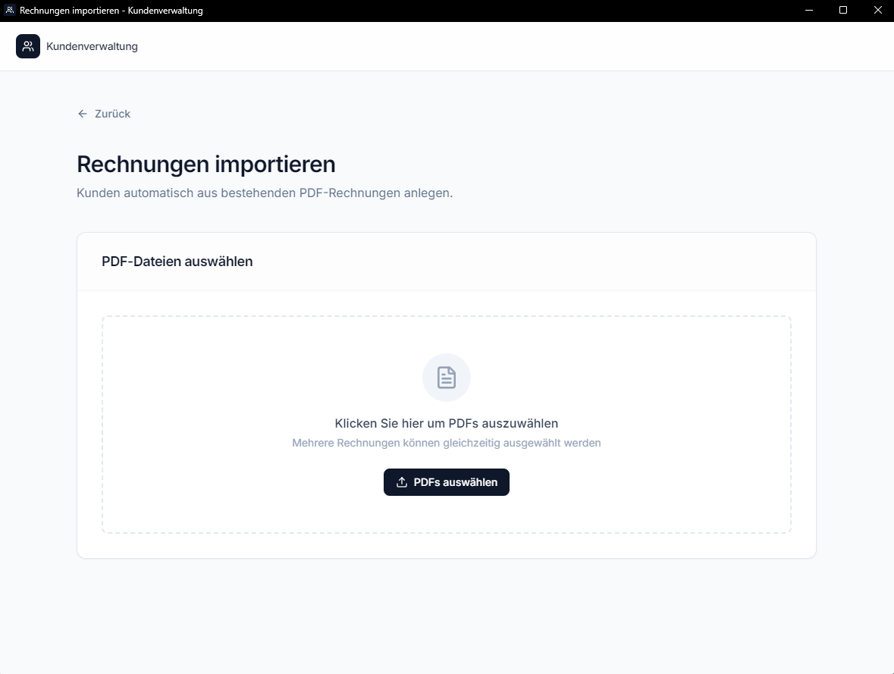

# Kundenverwaltung

Eine Desktop-Anwendung zur Verwaltung von Kunden und Aufträgen für kleine Handwerksbetriebe - entwickelt mit Electron.


## ✨ Features

### Kundenverwaltung
- Kunden anlegen, bearbeiten und löschen
- Kontaktdaten (Name, Adresse, Telefon, E-Mail)
- Direkte Google Maps Integration

### Auftragsverwaltung
- Aufträge pro Kunde erstellen
- Datum, Preis und Beschreibung erfassen
- Mehrere Dateien (PDFs, Bilder) pro Auftrag anhängen

### PDF-Rechnungsimport 📄
- **Automatischer Import** aus bestehenden PDF-Rechnungen
- Extrahiert Kundendaten (Name, Adresse, Ansprechpartner)
- Extrahiert Auftragsdaten (Datum, Preis, Leistungsbeschreibung)
- Hängt die Original-PDF automatisch an
- Duplikaterkennung

## 🛠️ Tech Stack

- **Frontend:** HTML, JavaScript, Tailwind CSS
- **Desktop:** Electron
- **PDF-Parsing:** pdf-parse
- **Icons:** Lucide Icons
- **Datenspeicherung:** Lokale JSON-Dateien (keine Cloud/Server nötig)

## 📦 Installation

```bash
# Repository klonen
git clone https://github.com/[username]/kundenapp.git
cd kundenapp

# Abhängigkeiten installieren
npm install

# App starten
npm start
```

## 🏗️ Build

Windows-Installer erstellen:

```bash
npm run build
```

Die `.exe` Datei wird im `dist/` Ordner erstellt.

## 🧪 Tests

```bash
npm test
```

## 📁 Projektstruktur

```
kundenapp/
├── main-electron.js    # Electron Main Process
├── preload.js          # Preload Script (IPC Bridge)
├── index.html          # Kundenübersicht
├── customer.html       # Kundendetails
├── new-customer.html   # Kunde anlegen/bearbeiten
├── order.html          # Auftrag anlegen/bearbeiten
├── import-customers.html # PDF-Import
├── main.js             # Frontend Logic
├── utils.js            # Hilfsfunktionen
└── styles.css          # Custom Styles
```

## 🔒 Datenspeicherung

Alle Daten werden **lokal** gespeichert:
- `%AppData%/kundenapp/customers.json` - Kundendaten
- `%AppData%/kundenapp/customer_files/` - Angehängte Dateien

Keine Cloud-Anbindung, keine externen Server - die Daten bleiben auf dem Rechner.

## 📸 Screenshots

### Kundenübersicht


### Kundendetails


### PDF-Import


## 🚀 Geplante Features

- [ ] Umsatz-Statistiken Dashboard
- [ ] Rechnungen erstellen & PDF-Export
- [ ] Kalender für Terminplanung
- [ ] Automatische Updates

## 📄 Lizenz

MIT License

---

*Entwickelt als praktisches Projekt für einen Garten- und Landschaftsbaubetrieb.*
